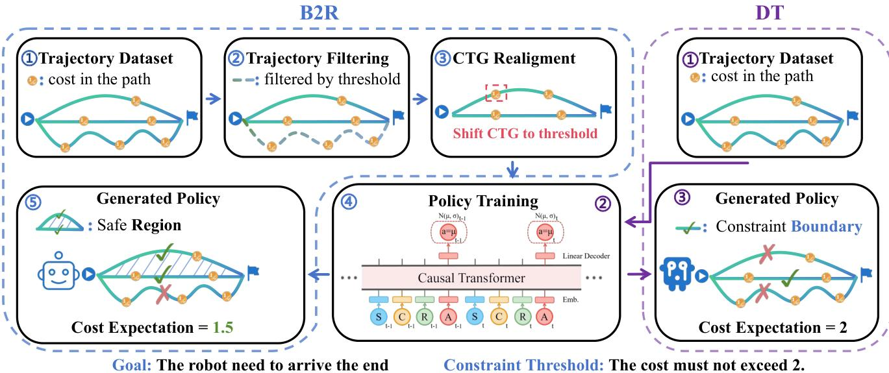
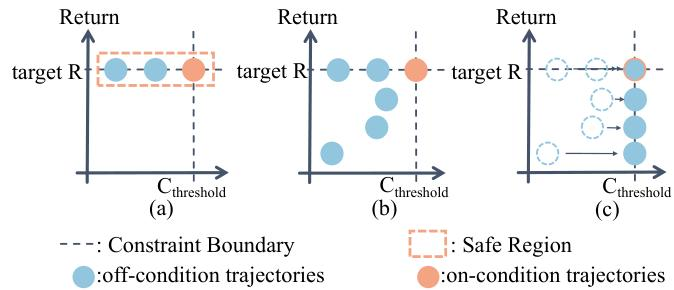

# Boundary-to-Region Supervision for Offline Safe Reinforcement Learning (NIPS2025)

This repository provides the official implementation of **B2R**. It is evaluated on the [DSRL benchmark](https://github.com/decisionintelligence/DSRL) across SafetyGymnasium, BulletSafetyGym, and MetaDrive environments.

Problem → Existing sequence models (Decision Transformer–style) treat return-to-go (RTG) and cost-to-go (CTG) symmetrically. But in constrained MDPs, RTG is a flexible target; CTG is a non-negotiable safety budget. This “symmetry fallacy” causes:
- Brittle deployment: picking a feasible RTG/CTG pair is guesswork.
- Sparse training signal: few trajectories sit near the safety boundary, so supervision is thin and unreliable.

Insight → Safety is a boundary, not a knob. If the model always sees the same boundary token (the deployment budget), it can learn all the diverse safe behaviors inside that region, not just rare near-threshold cases.

Solution (B2R): Boundary-to-Region supervision that makes conditioning asymmetric by realigning CTG to the budget. Three steps: filter, realign, encode. The result is dense, region-wide safety supervision without changing the Transformer objective or architecture.



How B2R works in practice:
1) Trajectory filtering: drop unsafe trajectories whose total cost exceeds the deployment budget κ.
2) CTG realignment: shift each safe trajectory’s cost-to-go so CTG starts at κ while preserving its strictly decreasing temporal profile:
   C′t = Ct + (κ − C(τ)).
3) Temporal encoding with RoPE: rotary positional embeddings capture relative, step-by-step dynamics better than absolute positions.



Why it works (intuition):
- The model is always conditioned on a fixed boundary token (CTG = κ). RTG stays a user-controlled target.
- Training sees the same boundary across many safe behaviors → supervision becomes dense and consistent.
- At inference, RTG and CTG update by subtracting observed rewards/costs each step, anchoring safety while tuning ambition.

Grounding in theory:
- With aligned data and bounded per-step cost error σ, if σH < δ (H = horizon, δ = safety margin), B2R achieves:
  • High-probability safety: violation probability shrinks exponentially in (δ − σH)^2 / (2H C_max^2).
  • Expected safety: E[cumulative cost] ≤ κ − (δ − σH).
- With “optimal coverage” in the filtered data, region-wide supervision contains boundary-only supervision, so reward is no worse while constraints are satisfied.

Hard data across 38 tasks (Safety Gymnasium, Bullet Safety-Gym, MetaDrive; 3 cost limits × 3 seeds):
- B2R satisfies safety in 35/38 and ranks first on average.
- Highest rewards in 20 tasks.
- Consistently lower cost than Constrained Decision Transformer (CDT) while matching or beating reward. Tightening CDT’s boundary token isn’t enough—what matters is region-wide supervision.

Robustness and flexibility:
- Safe data scarcity (5–50% of safe trajectories): B2R degrades gracefully; often retains safety at 20% due to dense supervision.
- Multi-target extension: one model supports multiple κ values via per-κ realignment and conditioning—comparable to single-target models.

Takeaway: Stop treating safety like reward. Align cost signals to the actual budget and supervise across the whole safe region. B2R keeps DT’s simplicity, adds safety guarantees, and improves the safety–performance frontier—no architectural surgery required.

## 🚀 Quick Start

### Installation

```bash
# Clone the repository
git clone https://github.com/yourusername/B2R-ULTRA.git
cd B2R-ULTRA

# Install the package
pip install -e .
```

### Training

```bash
python main/B2R_main.py --env CarButton1 --cost_limit 20 --seed 0
```

## 🙏 Acknowledgements

- [DSRL](https://github.com/decisionintelligence/DSRL) – Benchmark for offline safe RL
- [Decision Transformer](https://github.com/kzl/decision-transformer) – Transformer-based RL modeling

## 📄 Citation

```bibtex
@inproceedings{b2r2025,
  title={Boundary-to-Region Supervision for Offline Safe Reinforcement Learning},
  author={Huikang Su, Dengyun Peng, Zifeng Zhuang, YuHan Liu, Qiguang Chen, Donglin Wang, Qinghe Liu},
  booktitle={NeurIPS},
  year={2025}
}
```

## 🛠 License
This project is licensed under the MIT License.
